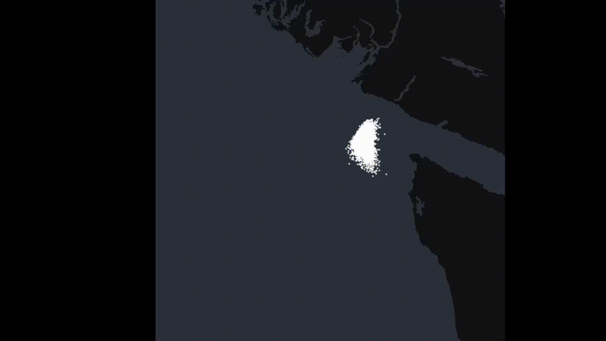

DriftMap2D is a client-side, multi-tracer Lagrangian particle tracking model that runs entirely in the browser via WebAssembly. It is primarily used to determine the fate and trajectory of simulated tracers (such as oil or a search and rescue object) in the ocean.

DriftMap2D performs all modelling calculations client-side. It achieves this by streaming processed and tiled hydrodynamical data from a CDN ahead of simulation time, and by using a rust engine compiled to WASM to interpolate, integrate, and apply tracer-specific physics, DriftMap2D can complete drift simulations in seconds with real-time visualization.

DriftMap2D currently supports the following tracer modules:

    - Generic Drift
    - Oil Weathering
    - Search and Rescue (Leeway)

Generic Drift does not have any tracer-specific physics; it is purely an ocean and wind drift module akin to OpenDrift's OceanDrift.

Oil Weathering models emulsification and evaporation for 1460 ADIOS oils. The weathering parameterizations were primarily ported from PyGnome.
https://github.com/NOAA-ORR-ERD/PyGnome

Search and Rescue is a port of OpenDrift's Leeway model and supports all 85 Leeway objects provided by OpenDrifts' object property database.
https://github.com/OpenDrift/opendrift/blob/master/opendrift/models/OBJECTPROP.DAT

Generic Drift and Search and Rescue models have been validated against Opendrift:

DriftMap2D currently serves processed tiles from the following global forcing products:

    For Ocean Currents (uo, vo): 
        - SMOC (Surface Merged Ocean Current). An hourly, 1/12 degree surface ocean currrent velocity product by CMEMS that includes Stokes' drift and tidal drift, eliminating the need for a separate wave model.
        https://data.marine.copernicus.eu/product/GLOBAL_ANALYSISFORECAST_PHY_001_024/download?dataset=cmems_mod_glo_phy_anfc_merged-uv_PT1H-i_202211

    For Wind and Sea Temperature (10u, 10v, skt):
        - IFS (Integrated Forecasting System). A 6-hourly, 1/4 degree global forecast by ECMWF Open Data.
        https://www.ecmwf.int/en/forecasts/datasets/open-data

There are plans to support higher-resolution regional forcing models in the future.

